### **Automatizando CI/CD con Ansible, Docker, SonarQube y GitHub Actions**

Desarrollo de una **automatización completa** del flujo de integración continua (CI) para mi proyecto usando SonarQube.
La meta era que cada cambio en el código pasara por un proceso bien estructurado: instalación de herramientas clave, ejecución de contenedores, integración con GitHub y análisis de calidad de código con SonarQube.

Para esto, primero apriviosono una máquina virtual en Azure usando lo documentado en [Terraform modules Vm](https://github.com/Ricardo965/vm-terraform-modules)

La dirección de la VM en el proceso de ejecución fue:

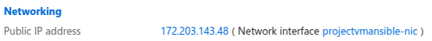

---

## **🚀 Instalación y Configuración**

Lo primero fue preparar el entorno. Usé **Ansible** para instalar **Docker** en mi maquina virtual, ya que necesitaba contenedores para ejecutar los servicios. Con el siguiente comando se instala Docker en mi VM:

```bash
ansible-playbook -i inventory/hosts.ini playbooks/install_docker.yml
```

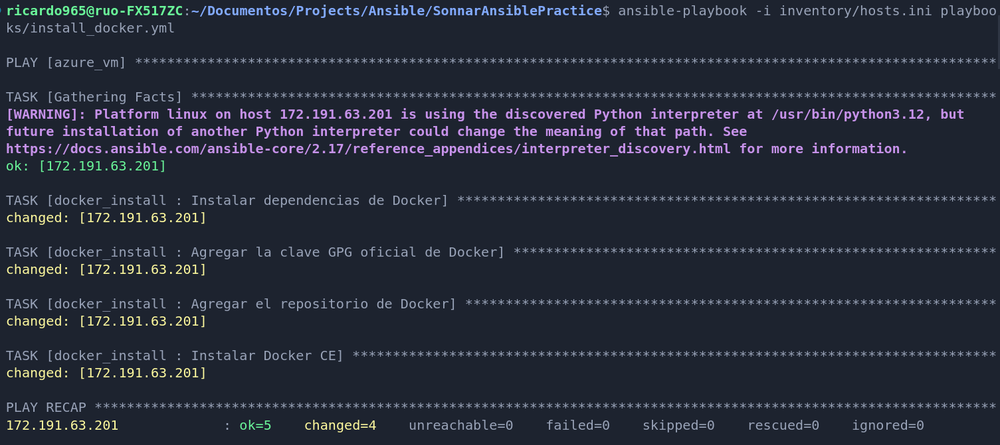

Después, instalé el **CLI de SonarQube**, ya que lo iba a necesitar más adelante para los análisis de código:

```bash
ansible-playbook -i inventory/hosts.ini playbooks/install_sonnarcli.yml
```

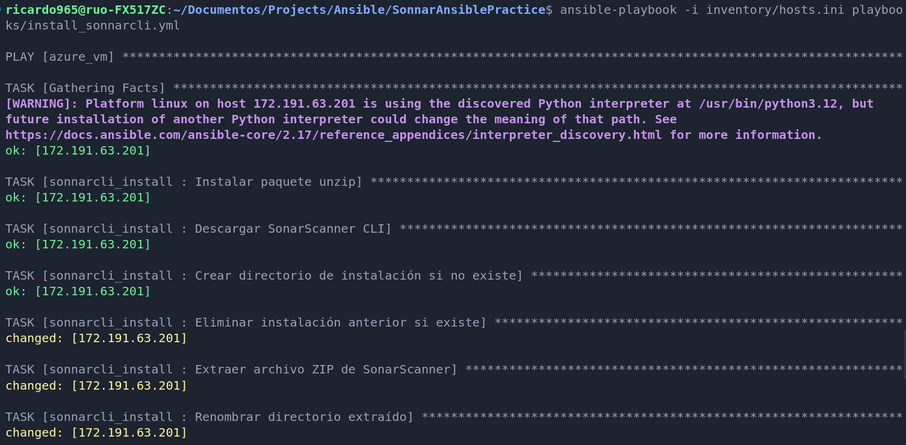

Con Docker y SonarQube listos, lancé los contenedores para correr los servicios necesarios:

```bash
ansible-playbook -i inventory/hosts.ini playbooks/run_container.yml
```

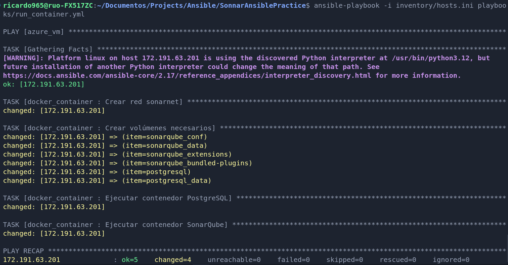

Finalmente, configuré **Nginx** y los certificados TLS para servir SonarQube usando HTTPS para poder integrar una GitHub app con mi instancia de SonarQube en la VM, dado que es un requisito que la comunicación entre estas 2 plataformas sea a través de HTTPS.

Para esto, primero tuve que obtener un dominio en GoDaddy pues **Let's Encrypt** no permite realizar certificados TLS a ip públicas.

Por ello, configuré el dominio con una regla A para mapear la dirección publica de mi VM:

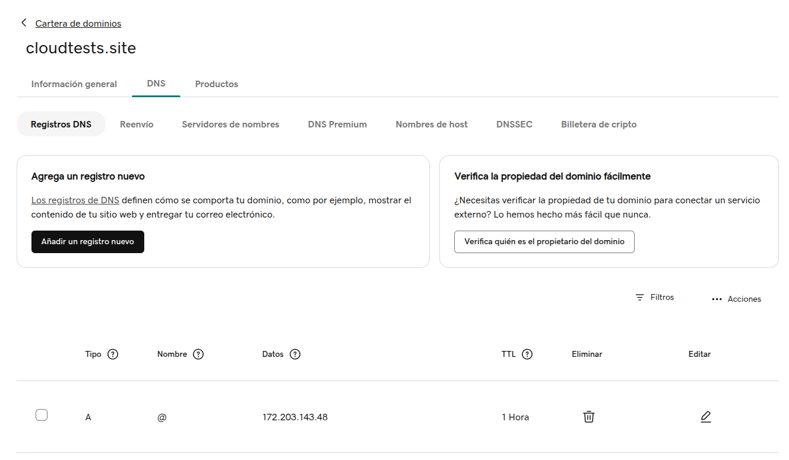

Este **playbook de Ansible** configura **Nginx** con **Let's Encrypt** para habilitar HTTPS y prepara el entorno para **SonarQube**.

Primero, instala los paquetes necesarios, detiene servicios en los puertos `80` y `443`, y limpia configuraciones previas. Luego, crea la estructura de archivos para la validación de **Let's Encrypt** y configura el firewall.

Después, configura **Nginx** para servir tráfico HTTP, verifica accesibilidad y ejecuta un **script de diagnóstico**. Si la validación es exitosa, obtiene un certificado SSL y automatiza su renovación. Finalmente, configura **Nginx** para servir **SonarQube** con o sin SSL, asegurando que el servicio esté accesible. 🚀

```bash
ansible-playbook -i inventory/hosts.ini playbooks/nginx_sonnar.yml
```

---

## **🔗 Integración con GitHub**

Para hacer que el código de mi repositorio estuviera siempre disponible en mi servidor, integré una **GitHub App**. Esto permitió hacer **pull automático** del código cada vez que hubiera un cambio en la rama `main`.

Para ello, primero tuve que configurar la URL base del servidor de Sonar en:

Administration > General > General > Base URL

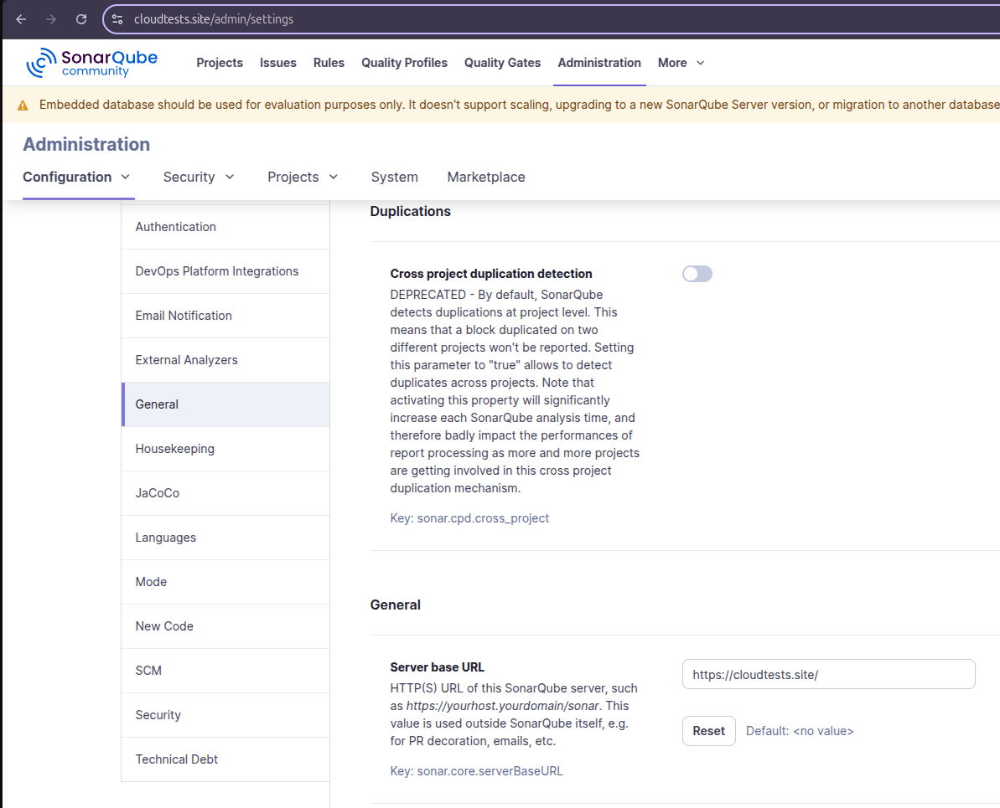

Esto para poder configurar el Callback URL de mi GitHub App, pues debe coincidir explicitamente para que funcione la autenticación.

Ahora bien, la configuración de la GitHub se hace de la siguiente forma:

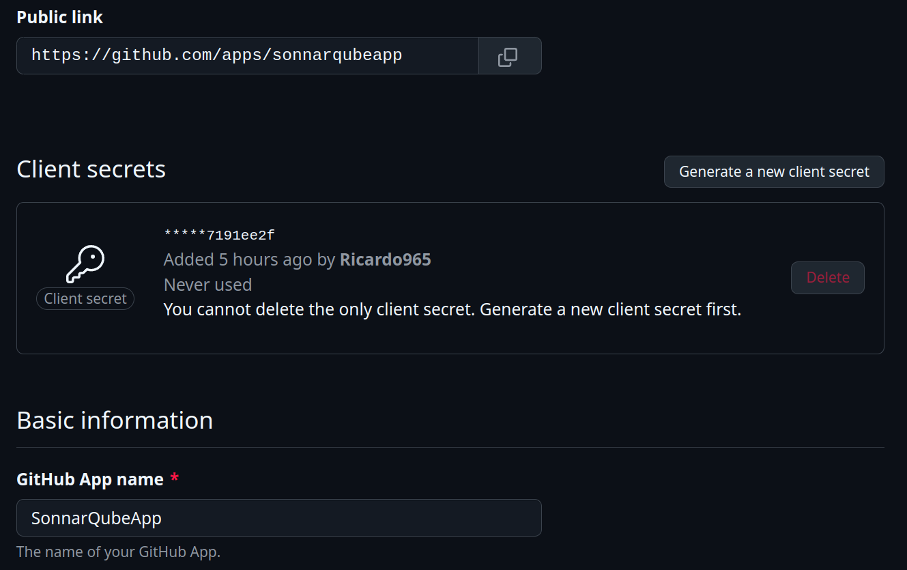

Se configura un nombre y se crea un Client Secret que será usado posteriormente por SonarQube. Hay que guardarlo cuidadosamente, pues solo se verá una única vez.

Ahora, se debe configurar un Homepage URL y el Callback URL, lo que debe coincidir con el Server Base URl que configuramos previamente en SonarQube. Estos links, sobre todo el de Callback URL debe usar HTTPS, de lo contrario dará error la autenticación.

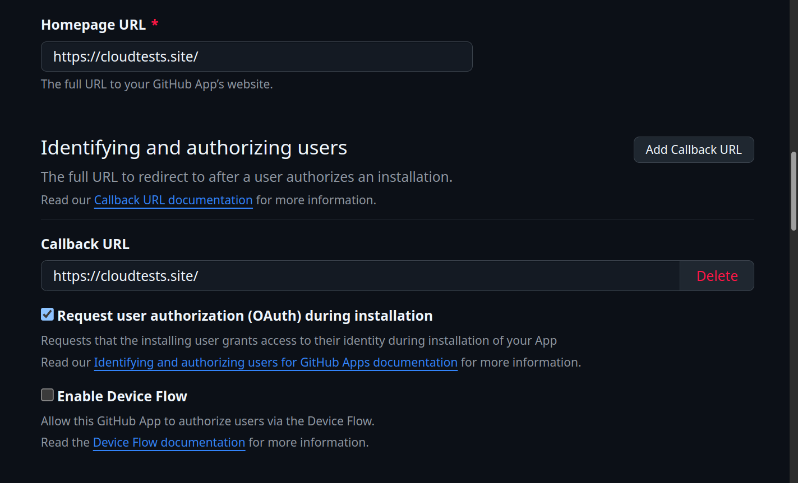

Añadido a esto, también se debe crear una private key en el momento de la configuración de la github app para usarla para autenticación con Sonar. Esta llave privada será usada en la config de autorización de Sonar.

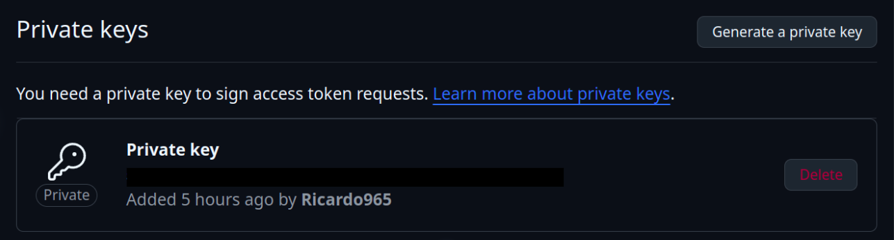

El apartado de webhook se deja vacío, pues para la integración básica para hacer checkout del repositorio no es necesaria.


Ahora bien, una vez hemos creado la github app, se debe instalar en alguna organización de la que se haga parte. Por ello, decidí instalarla en la organización por defecto de mi usuario de github.

Como también, se deben configurar permisos para pull requests, push, ramas, administración. Esto se puede ver a detalle en la documentación de la integracion de sonar con [github](https://docs.sonarsource.com/sonarqube-server/10.8/devops-platform-integration/github-integration/setting-up-at-global-level/setting-up-github-app/)

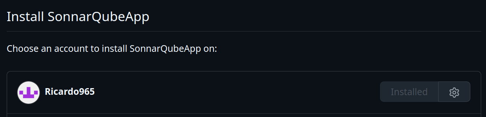

Después de realizar todos estos pasos, se debe configurar el sonar con los valores, secretos, ids y claves que hemos configurado en la GitHub App. Esto se logra al entrar a Projects > Import from GitHub. O también en Administration > Integration with DevOps platforms > GitHub en SonarQube.

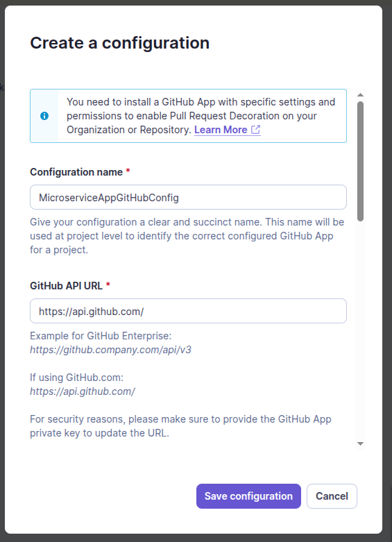

---

## **⚙️ Creación del Pipeline de CI**

Para el ejemplo de un pipeline de CI, voy a usar de ejemplo un repositorio de una aplicación de microservicios [microservices-app](https://github.com/Ricardo965/microservice-app-docker-practice). Para la configuración, se deben crear los siguientes secrets del repositorio:

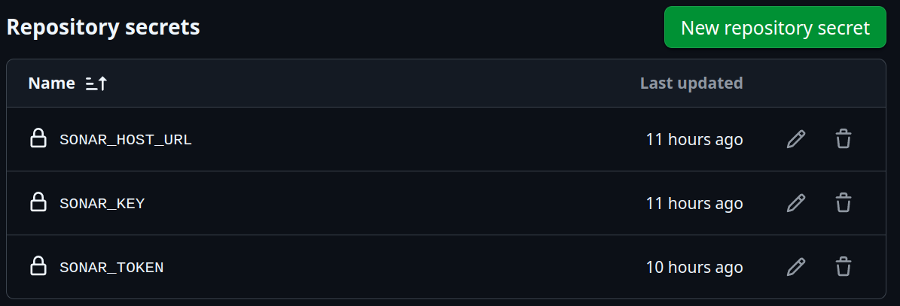

La llave y el token se generan al momento de seleccionar la importación de un projecto de github y el host URL es el mismo Server Base URL configurado en pasos anteriores:

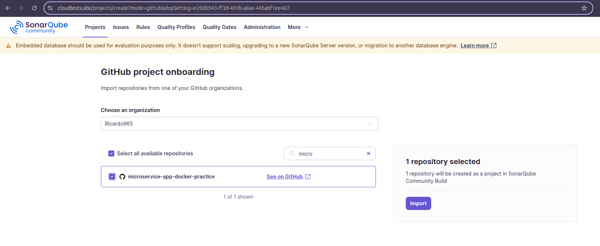
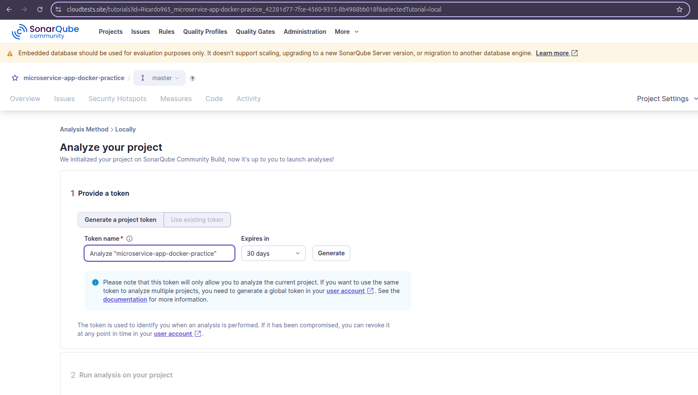

Con el entorno listo, el siguiente paso fue crear un **pipeline de CI con GitHub Actions**. Diseñé un workflow que se activara en cada push a `main`, compilara el código y lo analizara con SonarQube.

Aquí está el archivo `main.yml` que lo hace posible:

```yaml
name: Build

on:
  push:
    branches:
      - main

jobs:
  build:
    name: Build and analyze
    runs-on: ubuntu-latest

    steps:
      - name: Checkout repository
        uses: actions/checkout@v4

      - name: Set up JDK 8
        uses: actions/setup-java@v3
        with:
          distribution: "temurin"
          java-version: "8"

      - name: Build Java project with Maven
        run: mvn clean compile
        working-directory: users-api

      - name: Run SonarQube analysis
        uses: SonarSource/sonarqube-scan-action@v4
        env:
          SONAR_TOKEN: ${{ secrets.SONAR_TOKEN }}
          SONAR_HOST_URL: ${{ secrets.SONAR_HOST_URL }}
        with:
          args: >
            -Dsonar.java.binaries=users-api/target/classes
```

Este pipeline hace lo siguiente:

1. **Clona el repositorio** (`checkout`).
2. **Configura Java 8** para la compilación.
3. **Compila el proyecto con Maven** dentro del directorio `users-api`.
4. **Ejecuta el análisis de SonarQube**, asegurándose de apuntar a la carpeta correcta de los binarios compilados (`target/classes`).

---

## **✅ Resultado Final**

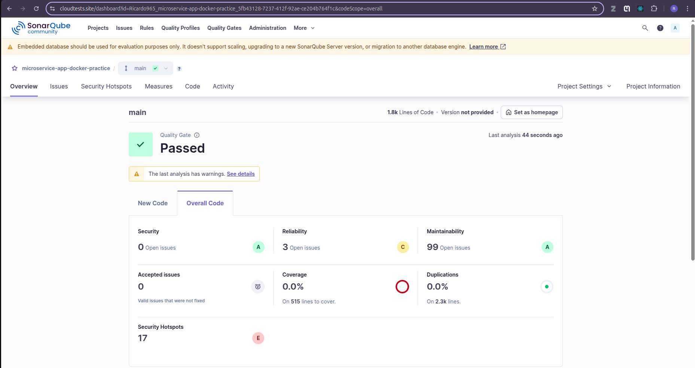

Con todo esto en su lugar, ahora cada vez que hago un push a `main`:

✅ El código se clona dentro del runner temporal de GitHub Actions.

✅ El runner instala Java y compila el código con Maven.

✅ El análisis de SonarQube se ejecuta desde el runner, enviando los resultados al servidor de SonarQube configurado.

✅ **SonarQube analiza la calidad del código**, ayudando a detectar errores y mejorar la mantenibilidad.

Ahora, tengo un proceso **automatizado y confiable** para mi CI, con una infraestructura sólida respaldada por **Ansible, Docker, SonarQube y GitHub Actions**. 🚀
